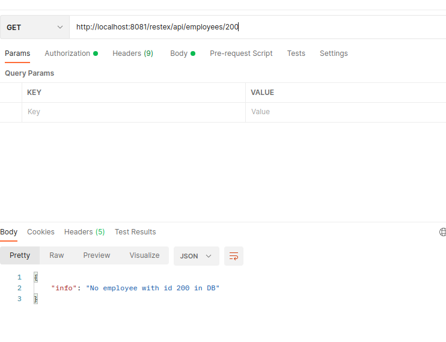
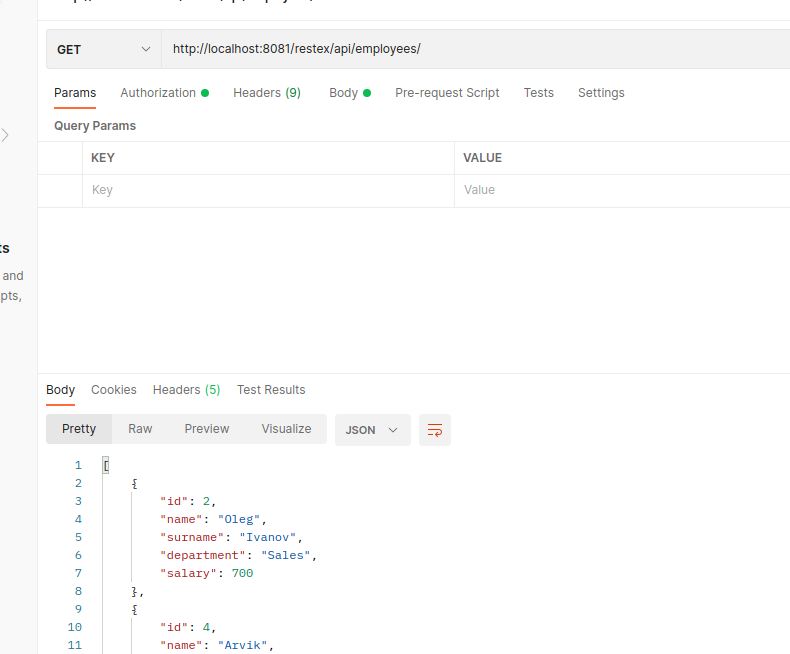
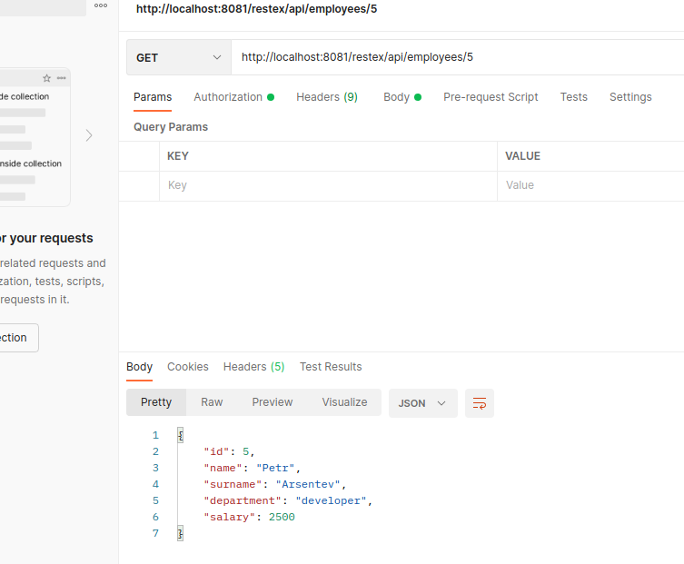
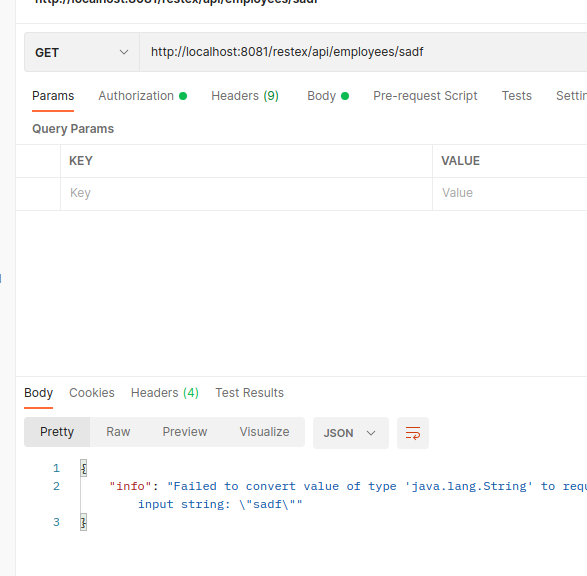

## restex
работа с джсонами, обработкой исключений ы качестве рест-сервиса, в качестве рест-клиента выступает репо [rest-client](https://github.com/ArvikVan/restprocess)
  выход за переделы имеющихся значений в бд

  список полный из бд

  выбор по id

  ввод некорректного id

### Контакты для связи 
 arvikvan@gmail.com 
 @ArvikV

###Используемые технологии:
- Maven
- Hibernate
- PostgreSQL
- Travis CI
- Apache Tomcat
- Spring MVC, REST

